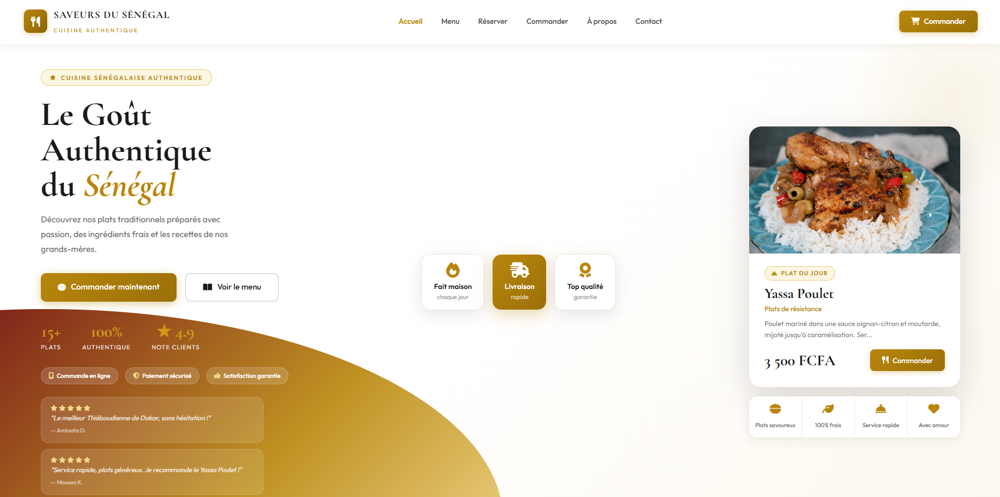
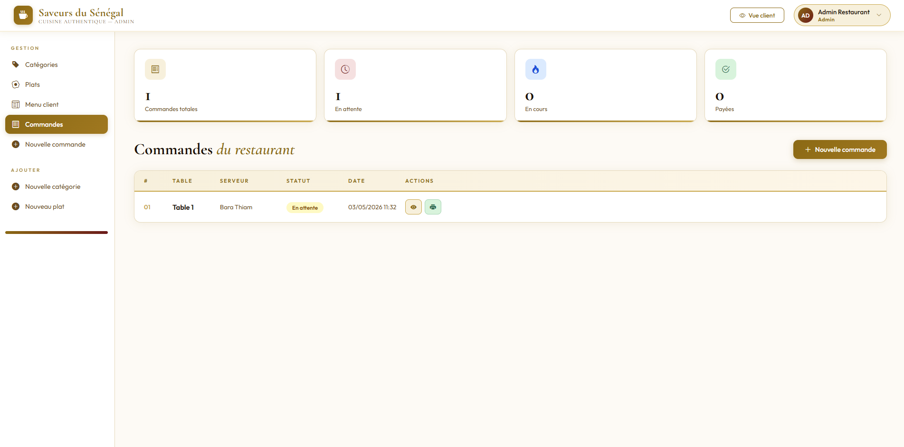
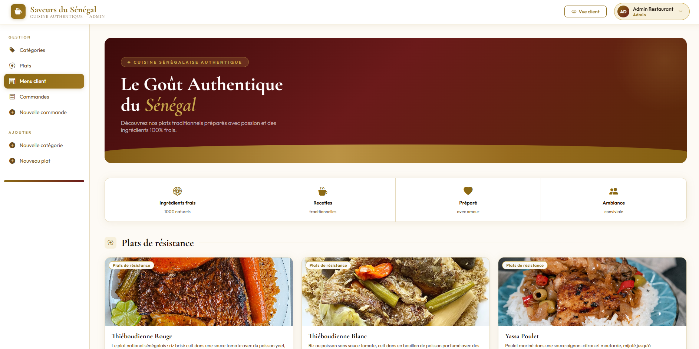
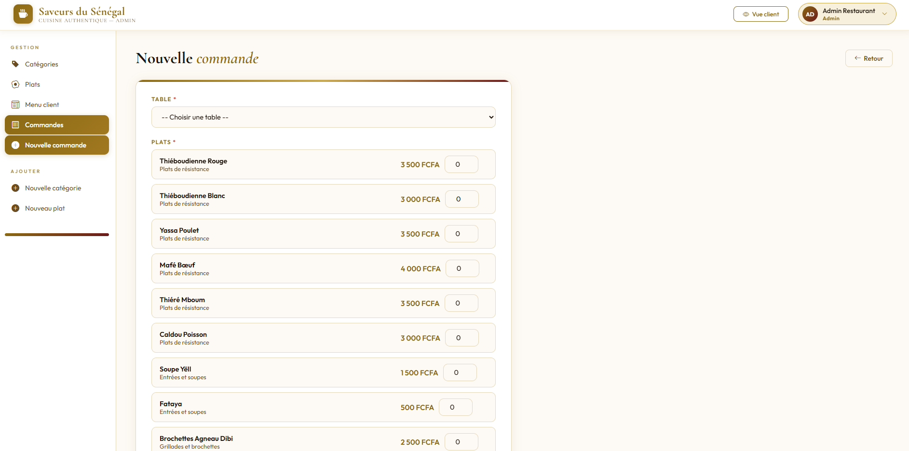
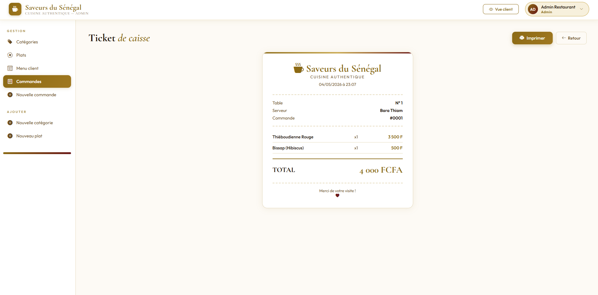
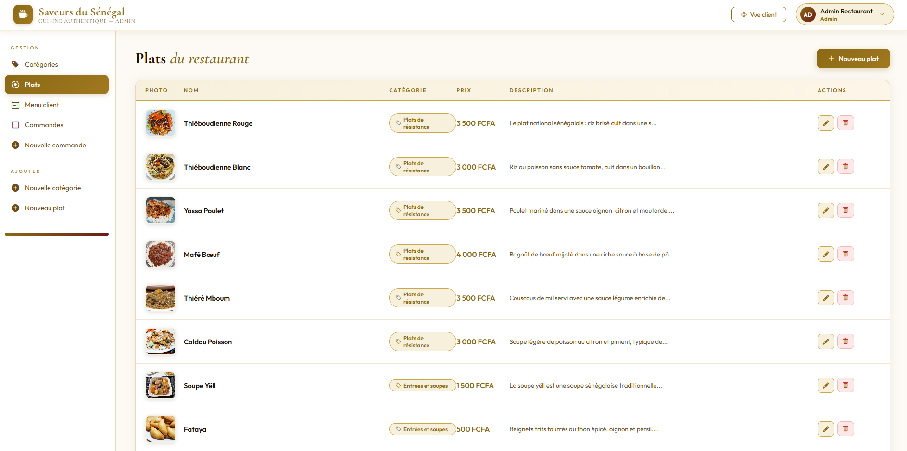
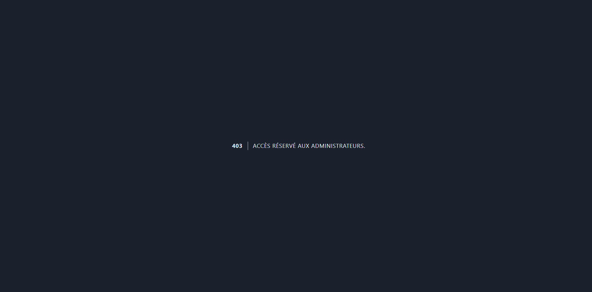

<div align="center">

# 🍽️ Saveurs du Sénégal

### Application web de gestion de restaurant

<br/>


<br/>

> Projet académique · L2 Génie Informatique · ESITEC / Groupe Sup de Co Dakar · 2025-2026

<br/>



</div>

---

## 📑 Table des matières

- [Vue d'ensemble](#-vue-densemble)
- [Fonctionnalités](#-fonctionnalités)
- [Stack technique](#-stack-technique)
- [Installation](#-installation)
- [Comptes de démonstration](#-comptes-de-démonstration)
- [Architecture](#-architecture-mvc)
- [Base de données](#-base-de-données)
- [Aperçu des pages](#-aperçu-des-pages)
- [Équipe](#-équipe)

---

## 🌍 Vue d'ensemble

**Saveurs du Sénégal** est une application web complète de gestion d'un restaurant développée avec **Laravel 12**. Elle permet à un gérant de piloter son restaurant depuis une interface admin et à ses serveurs de passer des commandes en temps réel.

<div align="center">

</div>

---

## ✨ Fonctionnalités

| Fonctionnalité | Statut |
|----------------|--------|
| 🔐 Authentification avec rôles (Admin / Serveur) | ✅ |
| 🍲 CRUD Plats, Catégories, Menus, Tables | ✅ |
| 🛒 Passage de commande multi-plats avec quantités | ✅ |
| 🧾 Génération de ticket de caisse | ✅ |
| 🖼️ Upload d'images pour les plats | ✅ |
| 🗑️ Soft delete sur les entités sensibles | ✅ |
| 🛡️ Middleware de rôle (protection des routes admin) | ✅ |
| 🌐 Interface client (Accueil · Menu · Réserver · Contact) | ✅ |
| 🌱 Seeders pour pré-remplir la base | ✅ |

---

## 🛠️ Stack technique

<div align="center">

| Technologie | Rôle |
|-------------|------|
|  | Framework PHP MVC |
|  | Langage backend |
|  | Base de données relationnelle |
|  | Moteur de templates |
|  | Interface utilisateur responsive |
|  | Gestion de version |

</div>

---

## ⚙️ Installation

### Prérequis

- 
- 
- 
- 

### Étapes

```bash
# 1. Cloner le dépôt
git clone https://github.com/Bara-Thiam/restaurant-manager-laravel.git
cd restaurant-manager-laravel

# 2. Installer les dépendances PHP
composer install

# 3. Installer les dépendances JS
npm install && npm run build

# 4. Configurer l'environnement
cp .env.example .env
php artisan key:generate
```

### 🔧 Configuration `.env`

```env
DB_CONNECTION=mysql
DB_HOST=127.0.0.1
DB_PORT=3306
DB_DATABASE=restaurant_db
DB_USERNAME=root
DB_PASSWORD=
```

> ⚠️ **Important :** Créer la base de données `restaurant_db` dans phpMyAdmin avant de continuer.

```bash
# 5. Migrer et seeder la base de données
php artisan migrate:fresh --seed

# 6. Créer le lien symbolique pour les images
php artisan storage:link

# 7. Lancer le serveur
php artisan serve
```

✅ L'application est accessible sur **`http://127.0.0.1:8000`**

---

## 🔐 Comptes de démonstration

<div align="center">

| Rôle | Email | Mot de passe | Accès |
|------|-------|--------------|-------|
| 👑 **Admin** | admin@restaurant.com | `password` | Interface complète |
| 🧑‍💼 **Serveur** | bara@gmail.com | `bara0705` | Commandes uniquement |

</div>

> Le middleware `role:admin` protège toutes les routes `/admin/*`. Un serveur connecté verra une erreur **403** s'il tente d'y accéder.

---

## 🏗️ Architecture MVC

```
resto/
├── app/
│   ├── Http/
│   │   ├── Controllers/
│   │   │   ├── Admin/
│   │   │   │   ├── CategorieController.php
│   │   │   │   ├── PlatController.php
│   │   │   │   ├── MenuController.php
│   │   │   │   └── TableController.php
│   │   │   └── CommandeController.php
│   │   └── Middleware/
│   │       └── CheckRole.php          ← middleware rôle custom
│   └── Models/
│       ├── Categorie.php
│       ├── Plat.php
│       ├── Menu.php
│       ├── TableRestaurant.php
│       └── Commande.php
├── database/
│   ├── migrations/
│   └── seeders/
│       ├── DatabaseSeeder.php
│       ├── CategorieSeeder.php
│       ├── PlatSeeder.php
│       └── TableRestaurantSeeder.php
├── resources/views/
│   ├── layouts/admin.blade.php        ← layout admin (bordeaux/or)
│   ├── admin/                         ← vues CRUD admin
│   ├── commandes/                     ← commandes + ticket
│   ├── welcome.blade.php              ← accueil public
│   ├── reserver.blade.php
│   ├── a-propos.blade.php
│   └── contact.blade.php
└── routes/web.php
```

---

## 🗃️ Base de données

### Schéma des relations

```
categories ──< plats >──────────────< commande_plat >──────────< commandes
                                     (pivot: quantite)
                                                                     │
                                                               table_restaurants
                                                                     │
                                                                   users
```

### Table pivot `commande_plat`

```sql
commande_plat
├── commande_id  FK → commandes.id
├── plat_id      FK → plats.id
└── quantite     INT  ← colonne pivot clé
```

---

## 📸 Aperçu des pages

### 🏠 Page d'accueil
<div align="center">

</div>

---

### 🍽️ Menu client
<div align="center">

</div>

---

### 🛒 Formulaire de commande
<div align="center">

</div>

---

### 🧾 Ticket de caisse
<div align="center">

</div>

---

### 🔧 Interface admin — Gestion des plats
<div align="center">

</div>

---

### 🚫 Page 403 — Accès refusé
<div align="center">

</div>

---

## 👥 Équipe

<div align="center">

| | Membre | Responsabilités |
|--|--------|-----------------|
| 👨‍💻 | **Sereigne Bara Thiam** | Auth · Rôles · Middleware · Commandes · Ticket · Architecture |
| 👨‍💻 | **Mouhamdou Mactar Camara** | Plats · Catégories · Upload images · Seeders |
| 👩‍💻 | **Yayra Joienella Aholou-Kotiko** | Tables · Menus · Interface client · Soft delete |

</div>

---

<div align="center">

**ESITEC — Groupe Sup de Co Dakar · L2 Génie Informatique · 2025-2026**


</div>
